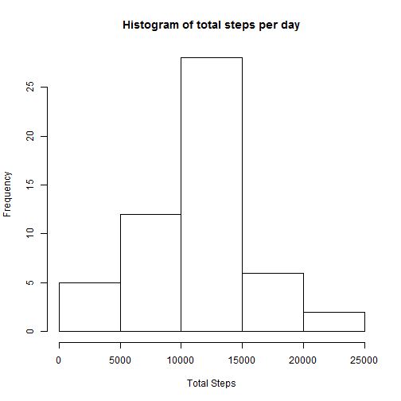
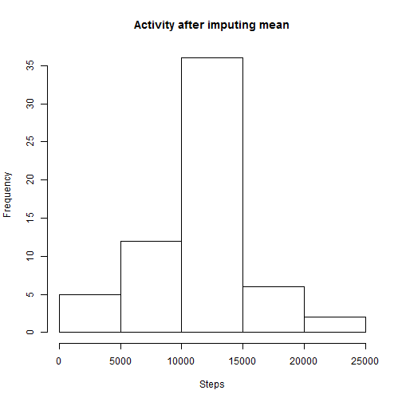
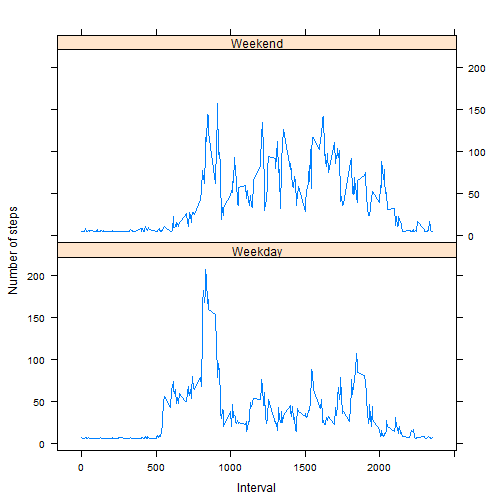

## Data ingest
The below code will download the data and load into R environment


```r
download.file("https://github.com/prashanthjayaseelan/RepData_PeerAssessment1/raw/master/activity.zip",destfile = "activity.zip")
unzip('activity.zip')
activity=read.csv("activity.csv")
```

##Answers to the question 'What is mean total number of steps taken per day?'
1.Calculation of the total number of steps:

```r
tot=aggregate(activity$steps~activity$date,activity,sum)
```

2.Histogram of the total number of steps:

```r
tot$date=strptime(tot$`activity$date`,"%Y-%m-%d")
hist(tot$`activity$steps`, xlab="Total Steps", main = "Histogram of total steps per day")
```



3.Calculate and report the mean and median of the total number of steps taken per day

```r
meanperday=mean(tot$`activity$steps`,na.rm = TRUE)
medianperday=median(tot$`activity$steps`,na.rm=TRUE)
```
Result: Mean of the total steps is 1.0766189 &times; 10<sup>4</sup> and median of total steps is 10765


## Answer to the question 'What is the average daily activity pattern?'
1. Make a time series plot (i.e. type = "l") of the 5-minute interval (x-axis) and the average number of steps taken, averaged across all days (y-axis)

```r
actavg=aggregate(activity$steps~activity$interval,activity,mean)
plot(actavg$`activity$interval`,actavg$`activity$steps`,type="l", xlab="Interval in minutes",
     ylab="Average number of steps", main="Average number of steps across all days")
```


2.Which 5-minute interval, on average across all the days in the dataset, contains the maximum number of steps?

```r
maxsteps = which(actavg$`activity$steps`==max(actavg$`activity$steps`))
maxint = actavg[maxsteps,1]
```
The result is 835

## Imputing missing values
1.Calculate and report the total number of missing values in the dataset (i.e. the total number of rows with NAs)

```r
sum(is.na(activity$steps))
```

```
## [1] 2304
```

2 & 3. Devise a strategy for filling in all of the missing values in the dataset. The strategy does not need to be sophisticated. For example, you could use the mean/median for that day, or the mean for that 5-minute interval, etc. Create a new dataset that is equal to the original dataset but with the missing data filled in.

```r
meanoverall=mean(actavg$`activity$steps`,na.rm = TRUE)
activity$steps[is.na(activity$steps)]=meanoverall
```

4.Make a histogram of the total number of steps taken each day and Calculate and report the mean and median total number of steps taken per day. Do these values differ from the estimates from the first part of the assignment? What is the impact of imputing missing data on the estimates of the total daily number of steps?

```r
actfillsum = aggregate(activity$steps~activity$date,activity,sum)
actfillmean = mean(actfillsum$`activity$steps`)
actfillmedian = median(actfillsum$`activity$steps`)
hist(actfillsum$`activity$steps`,xlab="Steps",main="Activity after imputing mean")
```



The new mean and median after imputing values are 1.0766189 &times; 10<sup>4</sup> and 1.0766189 &times; 10<sup>4</sup> respectively.


##Are there differences in activity patterns between weekdays and weekends?
1.Create a new factor variable in the dataset with two levels - "weekday" and "weekend" indicating whether a given date is a weekday or weekend day.


```r
activity$weekdays=weekdays(as.Date(activity$date))
activity$daytype=as.factor(ifelse(activity$weekdays=="Saturday" | activity$weekdays=="Sunday", "Weekend","Weekday"))
head(activity)
```

```
##     steps       date interval weekdays daytype
## 1 37.3826 2012-10-01        0   Monday Weekday
## 2 37.3826 2012-10-01        5   Monday Weekday
## 3 37.3826 2012-10-01       10   Monday Weekday
## 4 37.3826 2012-10-01       15   Monday Weekday
## 5 37.3826 2012-10-01       20   Monday Weekday
## 6 37.3826 2012-10-01       25   Monday Weekday
```

2.Make a panel plot containing a time series plot (i.e. type = "l") of the 5-minute interval (x-axis) and the average number of steps taken, averaged across all weekday days or weekend days (y-axis). See the README file in the GitHub repository to see an example of what this plot should look like using simulated data.


```r
pltavg=aggregate(activity$steps~activity$daytype+activity$interval,activity,mean)
library(lattice)
xyplot(pltavg$`activity$steps`~pltavg$`activity$interval`|pltavg$`activity$daytype`,type="l",xlab="Interval",ylab="Number of steps",layout=c(1,2))
```




